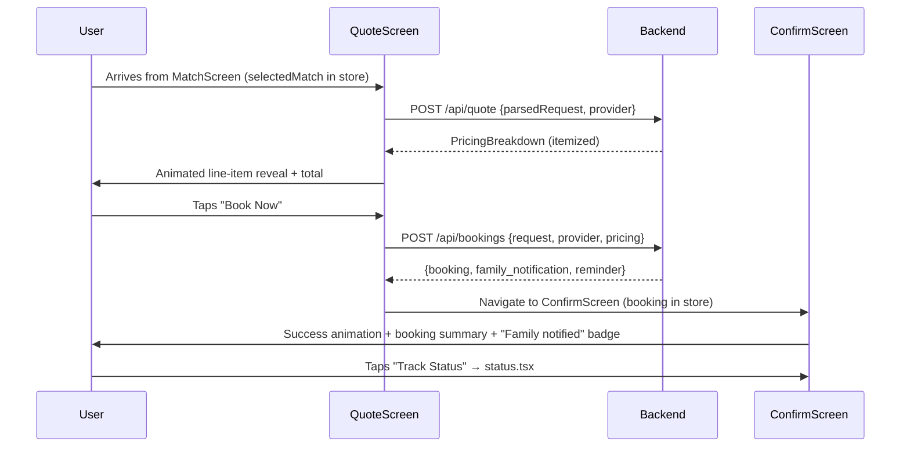

# Phase 3 — Pricing, Quote & Booking Implementation Plan

## Overview

Phase 3 wires together the pricing engine, quote display, booking creation, and booking confirmation — bridging the match result the user selected (in Phase 2) all the way through to a confirmed booking record.

**Dependencies already in place:**
- `types/pricing.ts` — `QuoteLineItem`, `PricingBreakdown` ✅
- `types/booking.ts` — `Booking`, `BookingTimelineEvent` ✅
- `constants/BookingStatuses.ts` — full lifecycle enum + labels/colors ✅
- `backend/src/routes/quoteRoutes.ts` — stub `POST /api/quote` ✅
- `backend/src/routes/bookingRoutes.ts` — stubs for all booking endpoints ✅
- `app/request/quote.tsx` — placeholder screen ✅
- `app/request/confirm.tsx` — placeholder screen ✅
- `hooks/useMatchStore.ts` — selected match already stored ✅
- `services/apiClient.ts` — typed `get`/`post` helpers ✅

---

## Proposed Changes

### 3.1 Pricing Engine (Backend)

#### [NEW] pricingEngine.ts
**Path:** `backend/src/services/pricingEngine.ts`

Implements the full pricing formula:

```
total = base_rate
      + distance_fee        (PKR 20/km × distance_km)
      + waiting_time_fee    (if urgency=high/emergency, flat 200 PKR)
      + complexity_fee      (based on specialization count, 0–500 PKR)
      + urgency_surcharge   (emergency +30%, high +15%)
      + add_ons             (wheelchair, family_friendly extras)
      - loyalty_discount    (10% off if user has ≥3 past bookings)
```

Returns a `PricingBreakdown` with itemized `QuoteLineItem[]`.

Also exposes:
- `suggestCheaperSlot(datetime, urgency)` — if urgency fee applies, returns next non-peak slot (next morning 9 AM) with savings amount

#### [MODIFY] quoteRoutes.ts
**Path:** `backend/src/routes/quoteRoutes.ts`

Replace stub with real handler:
- `POST /api/quote` — accepts `{ parsedRequest, provider }`, calls `pricingEngine.calculateQuote()`, returns `PricingBreakdown`

#### [NEW] Backend Pricing Types
**Path:** `backend/src/types/pricing.ts`

Mirror of `types/pricing.ts` (frontend) — `QuoteLineItem`, `PricingBreakdown`, with a backend-side `QuoteRequest` interface.

---

### 3.2 Quote Screen (Frontend)

#### [MODIFY] quote.tsx
**Path:** `app/request/quote.tsx`

Full implementation replacing the placeholder. Features:
- Reads `selectedMatch` from `useMatchStore`
- Calls `POST /api/quote` via a new `useQuote` hook (React Query mutation)
- **Animated sequential reveal** of line items (staggered `Animated.timing`)
- Itemized rows: label + amount, color-coded (green for discounts, red for surcharges)
- Bold total at the bottom
- **"Cheaper slot" banner** (conditional) — shows if a cheaper alternative exists, with a secondary CTA to choose it
- **"Book Now"** primary CTA → calls `POST /api/bookings`
- **"Change Provider"** secondary CTA → `router.back()` to match screen
- Loading skeleton + error state + retry

#### [NEW] useQuote.ts
**Path:** `hooks/useQuote.ts`

React Query mutation wrapping `POST /api/quote`. Stores result in a `useQuoteStore`.

#### [NEW] useQuoteStore.ts
**Path:** `hooks/useQuoteStore.ts`

Zustand store holding `PricingBreakdown | null` and `isAlternateSlotSelected: boolean`.

---

### 3.3 Booking Simulator (Backend)

#### [NEW] bookingSimulator.ts
**Path:** `backend/src/services/bookingSimulator.ts`

In-memory booking store (Map) with:
- `createBooking(request, provider, pricing)` → generates `Booking` with `booking_id`, status `confirmed`, initial `timeline` event
- `simulateStep(bookingId)` → advances status through `BOOKING_TIMELINE_STEPS`, appends timeline event
- `cancelBooking(bookingId)` → sets status `cancelled`, records reason
- `getBooking(bookingId)` → returns current booking state
- `getFamilyNotificationPayload(booking)` → returns structured notification object
- `getT60ReminderPayload(booking)` → returns reminder event payload

All bookings stored in memory (`Map<string, Booking>`) for demo — no DB needed.

#### [MODIFY] bookingRoutes.ts
**Path:** `backend/src/routes/bookingRoutes.ts`

Wire all stubs to `bookingSimulator`:
- `POST /api/bookings` — `createBooking()`, return `{ booking, family_notification }`
- `GET /api/bookings/:id` — `getBooking()`
- `GET /api/bookings/:id/status` — `{ status, timeline, provider_eta_minutes }`
- `POST /api/bookings/:id/simulate` — `simulateStep()`, return updated booking
- `POST /api/bookings/:id/cancel` — `cancelBooking()`, return updated booking

---

### 3.4 Booking Confirmation Screen (Frontend)

#### [MODIFY] confirm.tsx
**Path:** `app/request/confirm.tsx`

Full implementation:
- Reads booking from `useBookingStore` (set after `POST /api/bookings` succeeds)
- **Animated success checkmark** — Lottie-free: custom SVG-path stroke animation using `Animated` + `react-native-svg` (or pure Animated circle+check with stroke-dashoffset trick)
- Booking summary card: booking ID, provider name, service, date/time, total (PKR)
- **"Family notified" pill** — green badge with checkmark icon
- **"Track Status"** primary CTA → navigates to `app/request/status.tsx`

#### [NEW] useBooking.ts
**Path:** `hooks/useBooking.ts`

React Query mutation for `POST /api/bookings`. On success, stores result in `useBookingStore`.

#### [NEW] useBookingStore.ts
**Path:** `hooks/useBookingStore.ts`

Zustand store holding the active `Booking | null`.

---

## Data Flow (End-to-End for Phase 3)



---

## New Files Summary

| File | Type | Purpose |
|------|------|---------|
| `backend/src/services/pricingEngine.ts` | NEW | Pricing formula + line-item generation |
| `backend/src/types/pricing.ts` | NEW | Backend-side pricing types |
| `backend/src/services/bookingSimulator.ts` | NEW | In-memory booking store + lifecycle simulation |
| `hooks/useQuote.ts` | NEW | React Query mutation for POST /api/quote |
| `hooks/useQuoteStore.ts` | NEW | Zustand store for PricingBreakdown |
| `hooks/useBooking.ts` | NEW | React Query mutation for POST /api/bookings |
| `hooks/useBookingStore.ts` | NEW | Zustand store for active Booking |

| File | Type | Purpose |
|------|------|---------|
| `backend/src/routes/quoteRoutes.ts` | MODIFY | Wire to pricingEngine |
| `backend/src/routes/bookingRoutes.ts` | MODIFY | Wire to bookingSimulator |
| `app/request/quote.tsx` | MODIFY | Full QuoteScreen implementation |
| `app/request/confirm.tsx` | MODIFY | Full BookingConfirmationScreen |

---

## Verification Plan

### Backend
- Start backend (`npm run dev` in `/backend`) and use curl/Postman to verify:
  - `POST /api/quote` with a sample provider + parsed request returns itemized breakdown
  - `POST /api/bookings` returns a booking with status `confirmed` and timeline entry
  - `GET /api/bookings/:id` returns full booking
  - `POST /api/bookings/:id/simulate` advances the status step-by-step

### Frontend
- Navigate the full flow: Home → Understand → Match → **Quote → Confirm**
- Verify line items animate in sequentially
- Verify "Book Now" navigates to ConfirmScreen with booking ID
- Verify "Family notified" badge is visible
- Verify "Track Status" CTA navigates to status screen

---

## Open Questions

> [!NOTE]
> **Loyalty discount:** The formula applies 10% off if the user has ≥3 past bookings. Since there's no auth yet, this will be derived from `useRequestStore.recentRequests.length`. If ≥3, discount is applied. This is a reasonable demo approximation — let me know if you want a different threshold.

> [!NOTE]
> **Success animation:** Since this is Expo Go compatible (no Lottie/native modules), the checkmark animation will be implemented with `react-native-svg` (already available in Expo) using stroke-dashoffset animation. If `react-native-svg` isn't installed, I'll fall back to a pure-Animated scale/opacity approach with Ionicons checkmark.
